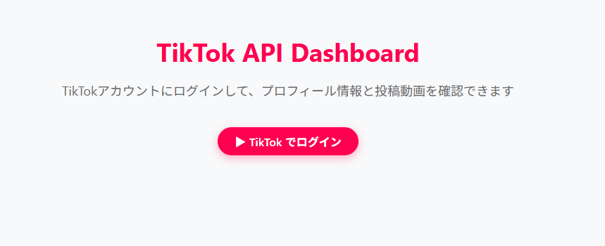
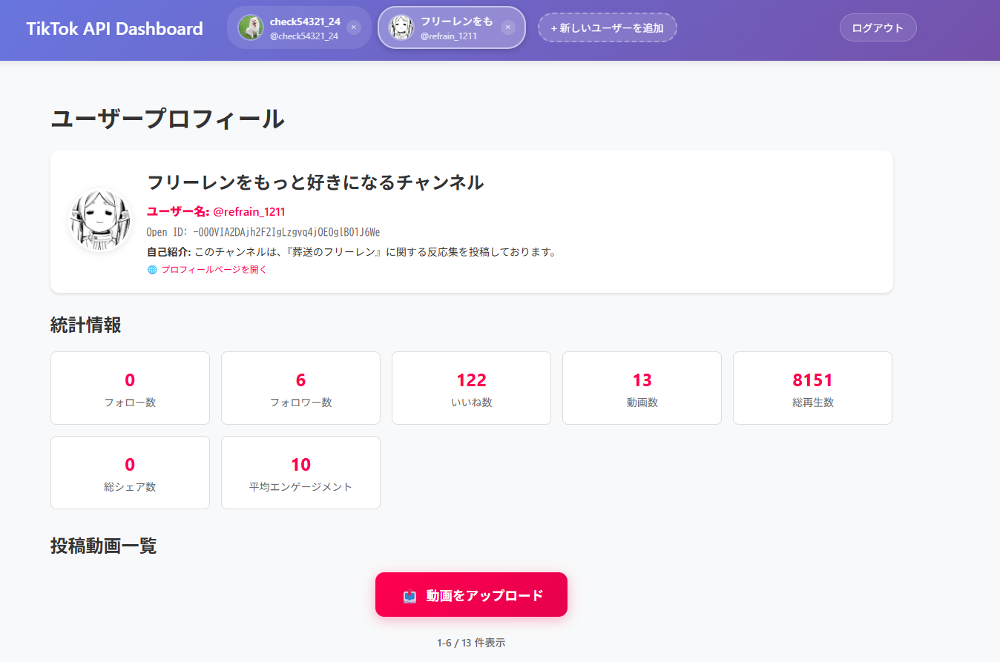
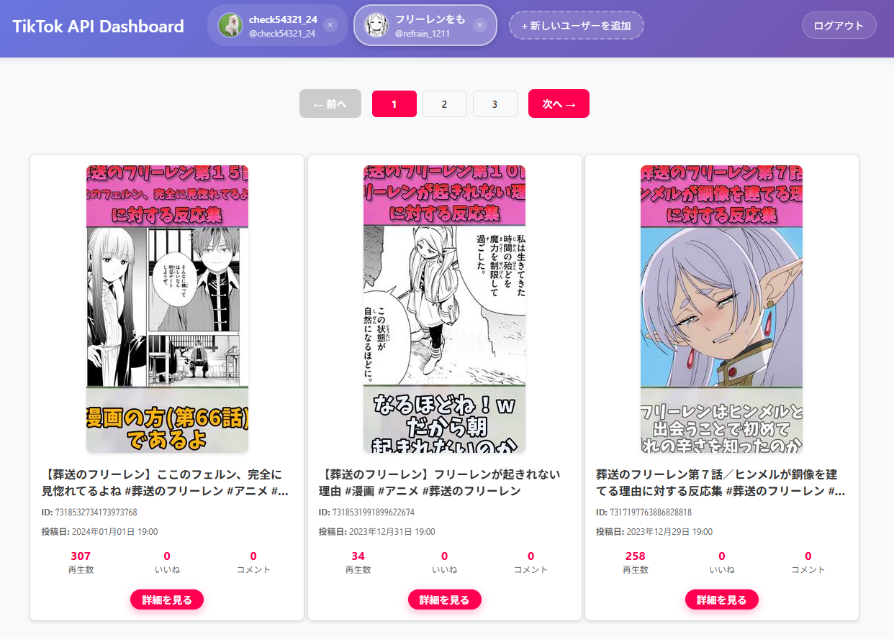
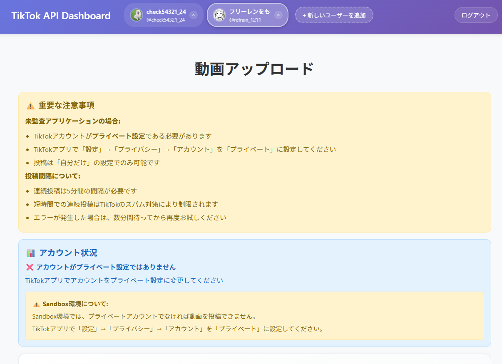
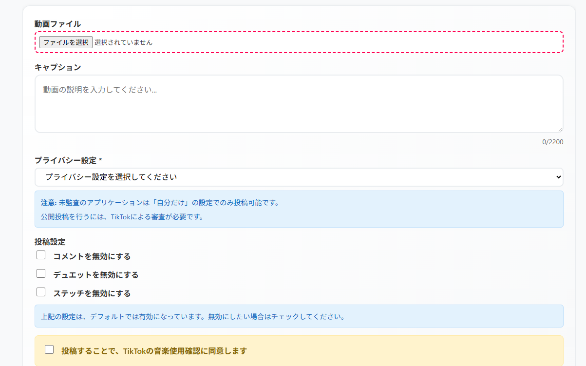
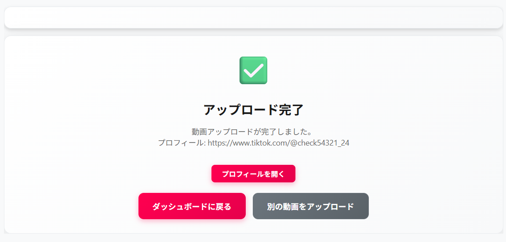

# TikTok API Features

[日本語](../README.md) | English

An application that retrieves and displays user profile information and posted videos using the TikTok API.

## UI Introduction (2025.08.05)

### Login Screen (/)

### Dashboard (/dashboard)

    
    

### Upload (/upload)

    
    
    

## Features

### Authentication & User Management

- **TikTok OAuth 2.0 Authentication (PKCE method)**
- **Multi-user Support**: Simultaneous management of multiple accounts
- **User Switching Function**: Easy account switching from header
- **Session Management**: Automatic access token renewal and expiration management

### Profile & Statistics Information

- **User Profile Information Retrieval & Display**
  - Avatar image, display name, username
  - Bio description, verified account display
  - Direct link to profile page
- **Detailed Statistics Display**
  - Following count, follower count, likes count, video count
  - Total view count, total share count, average engagement rate

### Video Management & Analysis

- **Posted Video List Retrieval & Display**
  - Thumbnail image card display
  - Pagination functionality (6 items per page)
  - Video ID, posting date, statistics display
- **Video Detail Information Display**
  - Duration, resolution, engagement rate
  - View count, like count, comment count, share count
  - Video viewing via TikTok embed link

### Video Upload Functionality

- **TikTok Content Posting API Support**
  - **Direct Post**: Immediate posting to TikTok
  - **Draft Post**: Posting possible later via TikTok app
- **Posting Configuration Options**
  - Caption (maximum 2200 characters, hashtag support)
  - Privacy settings (unaudited apps limited to "Self Only")
  - Comment, duet, stitch disable settings
- **File Management**
  - Video file size limit (maximum 100MB)
  - Supported formats: MP4, AVI, MOV, WMV
  - File information preview
- **Posting Restriction Handling**
  - 5-minute posting interval restriction
  - Automatic spam prevention error detection
  - Private account requirement verification
